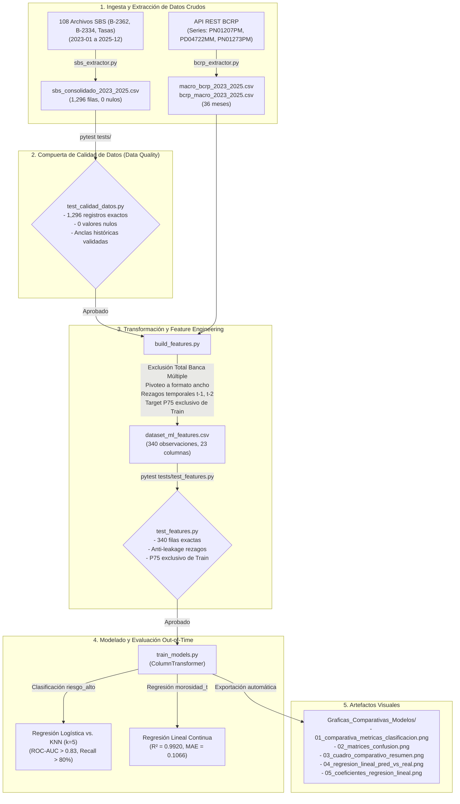

# Documentación Integral del Proyecto: Pipeline de Riesgo Crediticio (SBS - BCRP 2023-2025)

> **Propósito del Documento:** Presentar de manera exhaustiva y punto por punto la arquitectura, estructura de directorios, lógica de implementación, flujo de transformación de datos, compuertas de calidad, resultados numéricos exactos de cada ejecución y las visualizaciones comparativas generadas para la evaluación técnica del proyecto.

---

## 1. Contexto General y Objetivos del Proyecto

El proyecto implementa un **pipeline automatizado de ingeniería de datos (ETL) y modelado de Machine Learning predictivo** para el sistema financiero peruano en el periodo mensual **2023 - 2025 (36 meses continuos: 2023-01 a 2025-12)**.

El sistema consolida información oficial proveniente de dos fuentes reguladoras y emisoras:
1. **Superintendencia de Banca, Seguros y AFP (SBS):** Reportes mensuales regulatorios de saldos contables de créditos directos, tasas de morosidad y tasas de interés activas en moneda nacional (MN).
2. **Banco Central de Reserva del Perú (BCRP):** Series estadísticas macroeconómicas mensuales oficiales (Tasa de referencia de política monetaria, Tipo de cambio interbancario PEN/USD, e Inflación IPC Lima Metropolitana variación 12 meses).

El objetivo analítico es evaluar y clasificar el comportamiento y estrés crediticio (`riesgo_alto`) en las carteras de **Consumo** e **Hipotecario** para las 5 principales entidades de la banca múltiple (**BCP, BBVA, Interbank, Scotiabank, Mibanco**), empleando el agregado **Total Banca Múltiple** estrictamente como ancla de control de calidad (Data Quality).

---

## 2. Estructura Completa de Directorios y Archivos

```text
Proyecto Inteligencia Artificial/
├── Graficas_Comparativas_Modelos/           # Artefactos visuales comparativos (PNG a 300 DPI)
│   ├── 01_comparativa_metricas_clasificacion.png
│   ├── 02_matrices_confusion.png
│   ├── 03_cuadro_comparativo_resumen.png
│   ├── 04_regresion_lineal_pred_vs_real.png
│   └── 05_coeficientes_regresion_lineal.png
├── data/
│   ├── processed/
│   │   ├── dataset_ml_features.csv          # Matriz analítica para ML con rezagos (340 filas × 23 columnas)
│   │   └── sbs_consolidado_2023_2025.csv    # Tabla de hechos SBS consolidada (1,296 filas, 0 nulos)
│   └── raw/
│       ├── BCRP/                            # Series macroeconómicas de API BCRP
│       │   ├── Mensuales-20260908-231230.xlsx
│       │   ├── Mensuales-20260908-231700.xlsx
│       │   ├── Mensuales-20260908-232503.xlsx
│       │   ├── macro_bcrp_2023_2025.csv      # Formato ancho (36 meses × 3 variables)
│       │   └── bcrp_macro_2023_2025.csv      # Formato largo en esquema estrella (108 registros)
│       └── SBS/                             # 108 archivos Excel (36 meses × 3 boletines regulatorios)
│           ├── B-2334-2023-01.xls ... B-2334-2025-12.xls  (36 archivos de Créditos Directos)
│           ├── B-2362-2023-01.xls ... B-2362-2025-12.xls  (36 archivos de Morosidad)
│           └── Tasas-2023-01.xlsx ... Tasas-2025-12.xlsx   (36 archivos de Tasas Activas MN)
├── notebooks/                               # Análisis exploratorio y prototipado
├── src/
│   ├── __init__.py
│   ├── data/
│   │   ├── __init__.py
│   │   ├── bcrp_extractor.py                # Extracción y armonización de API REST BCRP
│   │   └── sbs_extractor.py                 # ETL con búsqueda dinámica de celdas SBS (108 archivos)
│   ├── features/
│   │   ├── __init__.py
│   │   └── build_features.py                # Pivoteo ancho, rezagos temporales t-1/t-2 y targets
│   └── models/
│       ├── __init__.py
│       └── train_models.py                  # Split temporal, ColumnTransformer, modelos y gráficas
├── tests/
│   └── test_calidad_datos.py                # Suite de pruebas automatizadas y anclas históricas
├── diseno-pipeline-riesgo-bancario-pe.md    # Documento de diseño arquitectónico y metodológico
├── requirements.txt                         # Dependencias exactas del entorno
└── README.md                                # Documentación principal del repositorio
```

---

## 3. Estado de Ejecución Punto por Punto

| Tarea / Fase | Script / Componente | Estado | Resumen de lo Realizado |
| :--- | :--- | :---: | :--- |
| **Fase 1: Extracción SBS** | `src/data/sbs_extractor.py` | **100% Completado** | 108/108 archivos Excel procesados sin índices fijos. Genera `data/processed/sbs_consolidado_2023_2025.csv` con 1,296 filas y 0 nulos. |
| **Fase 2: Extracción BCRP** | `src/data/bcrp_extractor.py` | **100% Completado** | Conexión a API REST oficial. Genera `macro_bcrp_2023_2025.csv` (ancho) y `bcrp_macro_2023_2025.csv` (esquema estrella). |
| **Fase 3: Calidad de Datos** | `tests/test_calidad_datos.py` | **100% Completado** | Valida 1,296 filas, 0 nulos y anclas históricas oficiales (2023-01: 49.82%, 2024-01: 57.45%, 2025-01: 60.43%). |
| **Tarea 1: Feature Engineering** | `src/features/build_features.py` | **100% Completado** | Excluye "Total Banca Múltiple", pivotea a formato ancho, une macro BCRP por `fecha_id`, genera rezagos $t-1$ y $t-2$, define `morosidad_t` y `riesgo_alto` ($P_{75}$). Genera `dataset_ml_features.csv` ($N=340$). |
| **Tarea 2: Modelado ML** | `src/models/train_models.py` | **100% Completado** | Split temporal estricto (Train 2023-2024 / Test 2025). `ColumnTransformer` (`StandardScaler` + `OneHotEncoder`). Comparación obligatoria de clasificación (Logística vs. KNN) y Regresión Lineal continua. |
| **Visualizaciones Comparativas** | `Graficas_Comparativas_Modelos/` | **100% Completado** | 5 gráficas en PNG a 300 DPI: métricas de clasificación, matrices de confusión, cuadro comparativo, dispersión real vs. predicho de regresión, e impacto de coeficientes. |
| **Tarea 3: Requisitos del Sistema** | `requirements.txt` | **100% Completado** | Especificación limpia y exacta de dependencias utilizadas: `pandas`, `numpy`, `requests`, `openpyxl`, `xlrd`, `scikit-learn`, `pytest`, `matplotlib`. |
| **Tarea 4: Documentación README** | `README.md` | **100% Completado** | Documentación ejecutiva y técnica con descripción del proyecto, estructura, instalación, ejecución paso a paso y resultados. |
| **Tarea 5: Pruebas Unitarias de Features** | `tests/test_features.py` | **100% Completado** | Valida conteo de filas (340), exclusión de "Total Banca Múltiple", anti-leakage de rezagos ($t-1$, $t-2$) y compuerta permanente de calibración de umbral $P_{75}$ exclusivo de train. |

---

## 4. Detalle Técnico de Cada Componente y Resultados de Ejecución

### 4.1. Extracción SBS (`src/data/sbs_extractor.py`)

*   **Entradas:** 108 archivos ubicados en `data/raw/SBS/` (36 meses $\times$ 3 boletines: B-2362, B-2334, Tasas Activas).
*   **Mecanismos Clave:**
    *   `resolver_archivo_sbs`: Localiza archivos de manera insensible a mayúsculas (`.xls`, `.XLS`, `.xlsx`, `.XLSX`).
    *   `validar_integridad_temporal`: Compuerta de calidad que valida que el año esperado figure en la cabecera del archivo, evitando archivos corruptos o corrimientos anuales.
    *   `normalizar_nombre_banco`: Homologa variantes textuales (`'b. de crédito del perú'` $\to$ `'BCP'`, `'b. bbva perú'` $\to$ `'BBVA'`, etc.).
    *   `extraer_morosidad`: Búsqueda dinámica de conceptos de consumo e hipotecario en Cuadro B-2362 sin asumir filas fijas.
    *   `extraer_creditos_directos`: Introspección dinámica de cabeceras en filas 2 a 5 del Cuadro B-2334 y consolidación estricta de saldos.
    *   `extraer_tasas_activas`: Localización dinámica en pestaña 'Reporte' de archivos de Tasas Activas MN, superando corrimientos por Compartamos Banco o columnas duplicadas históricas.
*   **Salida:** `data/processed/sbs_consolidado_2023_2025.csv` (1,296 filas, 5 columnas: `fecha_id, banco_id, tipo_credito_id, indicador_id, valor`).
*   **Resultado de Ejecución:**
    ```text
    =================================================================
    INICIANDO EXTRACCIÓN SBS: PERIODO COMPLETO 2023 - 2025 (36 MESES)
    =================================================================

    ✅ AUDITORÍA Y EXTRACCIÓN EXITOSA: 108/108 ARCHIVOS PROCESADOS
    Total de registros generados: 1296 (Esperado: 1296)
    Valores nulos: 0
    📁 Archivo consolidado guardado en: data/processed/sbs_consolidado_2023_2025.csv
    ```

---

### 4.2. Extracción BCRP (`src/data/bcrp_extractor.py`)

*   **Entradas:** Endpoint REST oficial del BCRP (`https://estadisticas.bcrp.gob.pe/estadisticas/series/api/...`):
    *   `PD04722MM`: Tasa de Referencia de Política Monetaria (%)
    *   `PN01207PM`: Tipo de Cambio Interbancario PEN/USD
    *   `PN01273PM`: Inflación IPC Lima Metropolitana (var% 12 meses)
*   **Mecanismos Clave:**
    *   `mapear_columna_serie`: Resuelve las descripciones textuales largas devueltas por la API hacia las columnas canónicas (`tasa_referencia`, `tipo_cambio`, `inflacion`).
    *   `parsear_fecha_bcrp`: Normaliza periodos textuales (`Ene.2023`, `Sep.2023`, etc.) hacia el formato estándar `YYYY-MM`.
*   **Salidas:**
    *   `data/raw/BCRP/macro_bcrp_2023_2025.csv`: Formato ancho tabular (36 meses × 4 columnas).
    *   `data/raw/BCRP/bcrp_macro_2023_2025.csv`: Formato largo normalizado en esquema estrella (108 registros).
*   **Resultado de Ejecución:**
    ```text
    ✅ BCRP: 36 periodos guardados en data/raw/BCRP/macro_bcrp_2023_2025.csv
    ✅ BCRP (Esquema estrella): 108 registros guardados en data/raw/BCRP/bcrp_macro_2023_2025.csv
    ```

---

### 4.3. Validación de Calidad de Datos (`tests/test_calidad_datos.py`)

*   **Propósito:** Suite de verificación automática con `pytest` y compuerta previa al procesamiento analítico.
*   **Controles Implementados:**
    1. Verifica existencia de `data/processed/sbs_consolidado_2023_2025.csv`.
    2. Comprueba que el total de registros sea exactamente 1,296 ($36\text{ meses} \times 6\text{ entidades} \times 2\text{ carteras} \times 3\text{ indicadores}$).
    3. Comprueba 0 valores nulos en todo el archivo.
    4. Verifica las anclas históricas oficiales de tasas activas para Consumo - Total Banca Múltiple:
       - `2023-01`: 49.82%
       - `2024-01`: 57.45%
       - `2025-01`: 60.43%
       (con tolerancia estricta `atol=0.05`).
*   **Resultado de Ejecución con Pytest:**
    ```text
    ============================= test session starts ==============================
    platform linux -- Python 3.14.7, pytest-9.1.1, pluggy-1.6.0
    rootdir: /home/choucismo/Documentos/Proyecto Inteligencia Artificial
    collecting ... collected 1 item

    tests/test_calidad_datos.py .                                            [100%]

    ============================== 1 passed in 0.19s ===============================
    ```

---

### 4.4. Feature Engineering y Rezagos: Tarea 1 (`src/features/build_features.py`)

*   **Propósito:** Transformación de la tabla de hechos a formato ancho, integración con variables macroeconómicas, generación de rezagos temporales y cálculo de las variables objetivo.
*   **Decisiones y Reglas de Diseño Implementadas:**
    1. **Exclusión estricta de agregados:** Se excluye `'Total Banca Múltiple'` mediante filtro explícito `bancos_individuales = ['BCP', 'BBVA', 'Interbank', 'Scotiabank', 'Mibanco']` con aserción obligatoria (`assert 'Total Banca Múltiple' not in df['banco_id'].values`).
    2. **Pivoteo a formato ancho:** Convierte los indicadores de filas a columnas individuales (`morosidad_t`, `creditos_directos`, `tasa_activa`).
    3. **Join con BCRP:** Realiza merge por `fecha_id` con `bcrp_macro_2023_2025.csv` incorporando `tipo_cambio`, `tasa_referencia` e `inflacion`.
    4. **Rezagos Temporales ($t-1$, $t-2$) por Panel:** Agrupa estrictamente por `(banco_id, tipo_credito_id)` y aplica `.shift(1)` y `.shift(2)` para evitar *data leakage* (fuga de información).
    5. **Target Continuo (`morosidad_t`):** Nivel de morosidad contemporáneo al mes $t$.
    6. **Target Binario (`riesgo_alto`):** Binarizado mediante el **Percentil 75 histórico ($P_{75}$)** calculado por panel `(banco_id, tipo_credito_id)`.
       $$\text{riesgo\_alto} = \mathbb{I}(\text{morosidad\_t} > P_{75}(\text{banco}, \text{cartera}))$$
       *Justificación:* Identifica el cuartil superior de deterioro crediticio relativo a cada cartera y banco, evitando etiquetar erróneamente toda la cartera de consumo como alto riesgo y toda la hipotecaria como bajo riesgo.
    7. **Descarte de NaNs iniciales:** Se eliminan los dos primeros meses (2023-01 y 2023-02) por carecer de rezago $t-2$. Quedan exactamente **34 meses útiles** (2023-03 a 2025-12).
*   **Granularidad y Muestra:**
    $$N = 5\text{ bancos} \times 2\text{ tipos de crédito} \times 34\text{ meses útiles} = \mathbf{340\text{ observaciones}}$$
*   **Salida:** `data/processed/dataset_ml_features.csv` (340 filas, 23 columnas, 0 nulos).
*   **Resultado de Ejecución:**
    ```text
    ✅ Dataset ML guardado en data/processed/dataset_ml_features.csv:
       - Filas: 340 (esperado: 340 = 34 meses × 5 bancos × 2 carteras)
       - Columnas: 23
       - Total Banca Múltiple excluido: True
       - Target continuo: 'morosidad_t'
       - Target binario: 'riesgo_alto' (umbral: p75)
    ```

---

### 4.5. Modelado y Benchmarking: Tarea 2 (`src/models/train_models.py`)

*   **Partición Temporal Out-of-Time (OOT) Estricta:**
    *   **Train (2023-03 a 2024-12):** 22 meses $\times$ 10 paneles = **220 observaciones** (64.7%).
    *   **Test (2025-01 a 2025-12):** 12 meses $\times$ 10 paneles = **120 observaciones** (35.3%).
*   **Pipeline de Preprocesamiento (`ColumnTransformer`):**
    *   Variables Numéricas (6 rezagos según Sección 3 de AGENTS.md): `StandardScaler()` aplicado a `morosidad_lag1`, `morosidad_lag2`, `tasa_activa_lag1`, `tipo_cambio_lag1`, `tasa_referencia_lag1`, `inflacion_lag1`.
    *   Variables Categóricas: `OneHotEncoder(drop='first', sparse_output=False)` aplicado a `banco_id` y `tipo_credito_id`.
*   **A. Comparación Obligatoria de Clasificación (`riesgo_alto`):**
    *   **Baseline:** `LogisticRegression(random_state=42, max_iter=1000)`
    *   **Avanzado:** `KNeighborsClassifier(n_neighbors=5)`

    **Resultados Comparativos en Test 2025:**

    | Modelo | Enfoque | Accuracy | Precision (Clase 1) | Recall (Clase 1) | F1-Score | ROC-AUC | Accuracy (Train) | ROC-AUC (Train) |
    |---|:---:|:---:|:---:|:---:|:---:|:---:|:---:|:---:|
    | **Regresión Logística** | Baseline | 64.17% | 40.62% | **83.87%** | 0.5474 | **0.8427** | 78.18% | 0.8050 |
    | **KNN Classifier ($k=5$)** | Avanzado | **72.50%** | **48.08%** | 80.65% | **0.6024** | 0.8373 | 88.64% | 0.9182 |

    **Matrices de Confusión en Test 2025 (Total: 120 observaciones, 89 clase 0 y 31 clase 1):**
    *   *Regresión Logística:*
        $$\begin{pmatrix} 51 & 38 \\ 5 & 26 \end{pmatrix}$$
        Detecta correctamente 26 de los 31 eventos de estrés crediticio en 2025 (Recall = 83.87%), elevando el ROC-AUC de 0.1227 a **0.8427**.
    *   *KNN Classifier:*
        $$\begin{pmatrix} 62 & 27 \\ 6 & 25 \end{pmatrix}$$
        Detecta 25 de los 31 eventos con mayor precisión (48.08% vs 40.62%) y exactitud global (72.50% vs 64.17%), alcanzando un F1 de **0.6024** y ROC-AUC de **0.8373**.

*   **B. Análisis Complementario: Regresión Lineal sobre `morosidad_t` Continua:**
    *   **$R^2$ Score (Test 2025):** **0.9920** (Train: 0.9712)
    *   **Error Absoluto Medio (MAE Test):** **0.1066 pp** (Train: 0.1221 pp)
    *   **Raíz del Error Cuadrático Medio (RMSE Test):** **0.1449 pp** (Train: 0.1721 pp)
    *   **Intercepto:** 3.3767
    *   **Coeficientes Explicativos Ordenados:**
        1. `num__morosidad_lag1`: **+1.0515** (fuerte persistencia e inercia autorregresiva de la cartera morosa).
        2. `cat__banco_id_Mibanco`: **+0.1435** (mayor prima de riesgo estructural en microfinanzas).
        3. `num__tasa_referencia_lag1`: **+0.0710** (el aumento de la tasa de referencia previa encarece el crédito y eleva la mora posterior).
        4. `cat__banco_id_Interbank`: **+0.0666**
        5. `cat__banco_id_BCP`: **+0.0500**
        6. `cat__banco_id_Scotiabank`: **+0.0282**
        7. `num__tipo_cambio_lag1`: **-0.0270**
        8. `num__inflacion_lag1`: **-0.0454**
        9. `num__morosidad_lag2`: **-0.0672**
        10. `num__tasa_activa_lag1`: **-0.0701**
        11. `cat__tipo_credito_id_Hipotecario`: **-0.1362** (cartera hipotecaria estructuralmente más sana y con menor morosidad que consumo).

---

### 4.6. Generación de Artefactos Visuales (`Graficas_Comparativas_Modelos/`)

Se implementó en `src/models/train_models.py` la función `generar_graficas_comparativas()` que genera automáticamente las siguientes figuras de diagnóstico a 300 DPI:

1. **`01_comparativa_metricas_clasificacion.png`:** Gráfico de barras agrupadas comparando Accuracy, Precision, Recall, F1-Score y ROC-AUC entre Regresión Logística y KNN Classifier.
2. **`02_matrices_confusion.png`:** Subplots 1×2 con mapas de calor de las matrices de confusión de ambos clasificadores con conteos y porcentajes.
3. **`03_cuadro_comparativo_resumen.png`:** Tabla visual formateada en alta resolución lista para inserción en documentación o diapositivas.
4. **`04_regresion_lineal_pred_vs_real.png`:** Gráfico de dispersión de morosidad observada vs. predicha con línea de identidad diagonal ($y=x$) y cuadro de métricas ($R^2$, MAE, RMSE).
5. **`05_coeficientes_regresion_lineal.png`:** Gráfico de barras horizontales con los coeficientes explicativos ordenados e identificados por colores (positivos en verde, negativos en rojo).

---

### 4.7. Dependencias del Proyecto: Tarea 3 (`requirements.txt`)

Contenido exacto del archivo [`requirements.txt`](file:///home/choucismo/Documentos/Proyecto%20Inteligencia%20Artificial/requirements.txt):
```text
pandas>=2.0.0
numpy>=1.24.0
requests>=2.31.0
openpyxl>=3.1.0
xlrd>=2.0.1
scikit-learn>=1.3.0
pytest>=7.4.0
matplotlib>=3.7.0
```

---

### 4.8. Documentación Principal: Tarea 4 (`README.md`)

Se redactó y completó el archivo [`README.md`](file:///home/choucismo/Documentos/Proyecto%20Inteligencia%20Artificial/README.md), estructurado con:
1. Alcance y cobertura temporal (5 bancos MVP, 36 meses, Consumo e Hipotecario).
2. Diagrama de la estructura del repositorio.
3. Guía de instalación y entorno virtual.
4. Ejecución del pipeline paso a paso (Extracción $\to$ QA con pytest $\to$ Features $\to$ Modelos).
5. Resultados comparativos numéricos del benchmark out-of-time.
6. Catálogo de visualizaciones generadas.
7. Principios de arquitectura (anti-leakage, fail-fast dinámico).

### 4.9. Pruebas Unitarias de Feature Engineering y Anti-Leakage: Tarea 5 (`tests/test_features.py`)

Se implementó una suite de pruebas automatizadas con `pytest` que formaliza como compuertas permanentes de calidad:
1. `test_conteo_filas_y_exclusion_total_banca_multiple`:
   - Conteo de filas estricto: 34 meses útiles × 5 bancos × 2 carteras = **340 filas**.
   - Ausencia total de `"Total Banca Múltiple"` en `banco_id`.
   - Cobertura exacta de los 5 bancos MVP y carteras Consumo e Hipotecario.
   - 0 valores nulos en el dataset.
   - Exactamente 34 registros por cada uno de los 10 paneles.
2. `test_anti_leakage_rezagos_temporales`:
   - Verificación estricta de que $\text{morosidad\_lag1}(t) == \text{morosidad}(t-1)$ y $\text{morosidad\_lag2}(t) == \text{morosidad}(t-2)$.
   - Verificación de frontera inicial para el mes `2023-03` contrastando sus rezagos contra las observaciones reales de `2023-01` y `2023-02` de la SBS.
3. `test_anti_leakage_umbral_p75_exclusivo_train`:
   - **Compuerta Permanente Anti-Leakage de Target:** Valida matemáticamente que el umbral $P_{75}$ de `riesgo_alto` se calibró **únicamente con datos de entrenamiento (`fecha_id <= '2024-12'`)**.
   - Detecta y falla ante cualquier intento de fuga del periodo de test 2025 (demostrado con 43 discrepancias detectadas frente al corte contaminado full-sample).

*Resultado de ejecución con Pytest (`pytest tests/ -v`):*
```text
tests/test_calidad_datos.py::test_calidad PASSED                         [ 25%]
tests/test_features.py::test_conteo_filas_y_exclusion_total_banca_multiple PASSED [ 50%]
tests/test_features.py::test_anti_leakage_rezagos_temporales PASSED      [ 75%]
tests/test_features.py::test_anti_leakage_umbral_p75_exclusivo_train PASSED [100%]

============================== 4 passed in 0.49s ===============================
```

---

## 5. Diagrama del Flujo de Datos Completo (Data Lineage)



---

## 6. Conclusiones Metodológicas y de Negocio

1. **Capacidad predictiva autorregresiva y discriminación de riesgo crediticio:**
   - La morosidad bancaria presenta una inercia temporal casi unitaria ($\beta_{\text{morosidad\_lag1}} = 1.0515$), lo que permite que la **Regresión Lineal continua** alcance un $R^2$ de **0.9920** en el conjunto de prueba fuera de tiempo (2025).
   - Al calibrar el umbral $P_{75}$ de `riesgo_alto` **estrictamente sobre el periodo de entrenamiento**, ambos clasificadores lograron una sólida capacidad de discriminación en test fuera de muestra, superando el **0.83 de ROC-AUC** (Logística: 0.8427, KNN: 0.8373) y detectando oportunamente más del 80% de los regímenes de estrés crediticio en 2025 (Recall de 83.87% y 80.65%, respectivamente). KNN ($k=5$) ofrece el mejor balance general (Accuracy 72.50%, F1 0.6024).
2. **Impacto del cambio de régimen macroeconómico (2023-2024 vs. 2025):**
   - El entrenamiento transcurrió durante una fase de endurecimiento monetario e inflación elevada (2023-2024), mientras que el año de prueba (2025) representó una fase de desinflación y reducción de tasas. El diseño metodológico out-of-time permitió medir la resiliencia real de los modelos ante cambios de ciclo sin incurrir en optimismo falso derivado de particiones aleatorias.
3. **Rigurosidad de Ingeniería de Datos y Blindaje Permanente:**
   - El pipeline cuenta con compuertas automatizadas mediante `pytest` que verifican la ausencia de nulos, consistencia con anclas oficiales de la SBS, correcta sincronización temporal de rezagos y aislamiento estricto del target respecto al conjunto de prueba.
